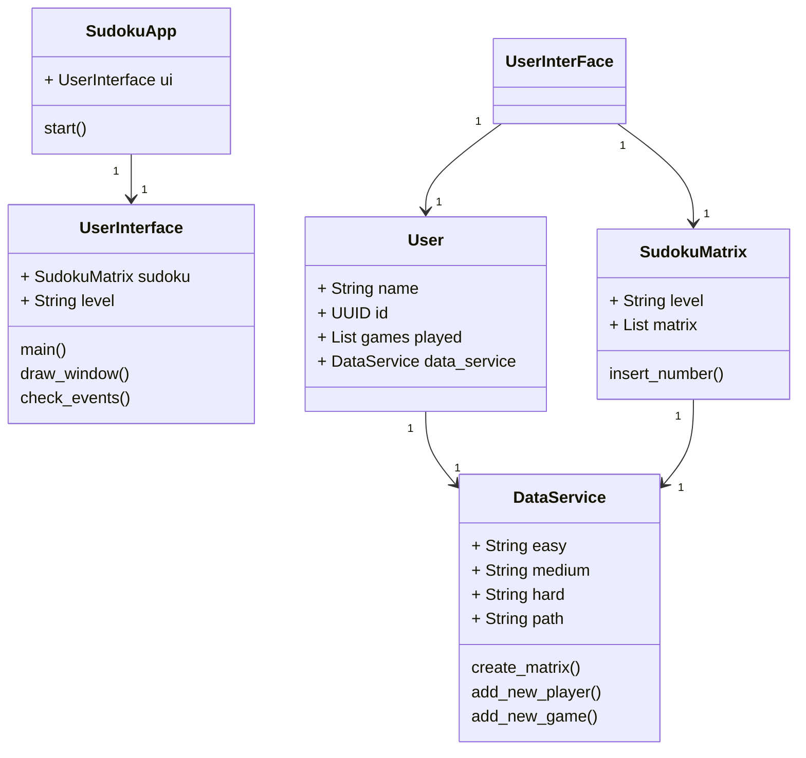
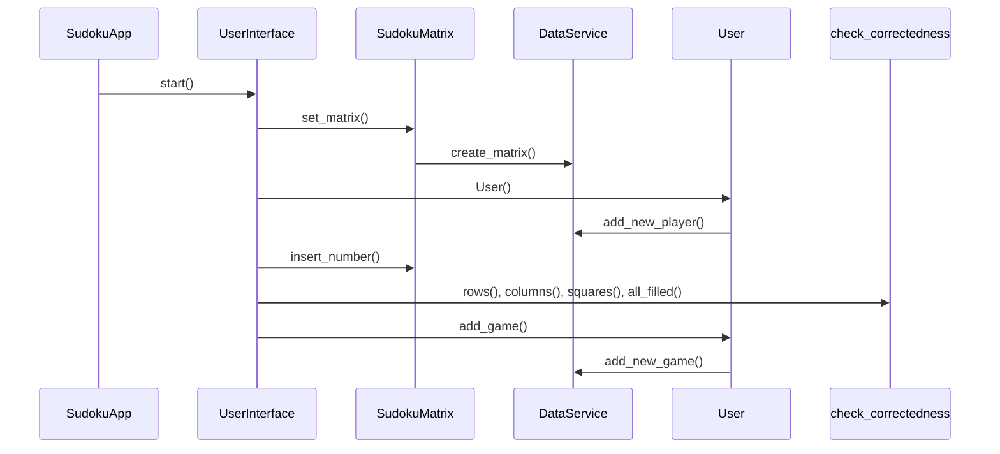

# Arkkitehtuurikuvaus

## Rakenne

Sovelluksen pakkausrakenne koostuu neljästä osasta: päähakemistosta, ja sen alihakemistoista services ja resources. Resources-osioon on ryhmitelty dataan liittyvät osat, ja services-osio sisältää kaikki sudokun tuottamiseen ja esittämiseen liittyvät alatoiminnot, joita pääluokka SudokuApp.py käyttää. Näiden lisäksi testaus on eriytetty omaksi pakkauksekseen.

## Käyttöliittymä

Sovelluksessa on graafinen käyttöliittymä, joka on toteutettu pygame-moduulin avulla. Käyttöliittymässä on kaksi näkymää.
Sovelluksen käyttöliittymä sisältää erillisen esinäkymän, ja toisen näkymän varsinaista pelitilaa varten. Esinäkymässä käyttäjä syöttää oman nimen tai nimimerkin ja valitsee pelin vaikeustason. Vaikeustason valinta siirtää pelaajan varsinaiseen pelinäkymään. Pelinäkymässä näytetään joitakin valmiita numeroita sisältävä sudoku-ruudukko, johon pelaaja voi syöttää lisää syötteitä. Syötteiden oikeellisuuden voi tarkastaa tarkasta-nappulaa painamalla. Mikäli virheitä löytyy, ne esitetään pelaajalle pelinäkymässä. Jos ruudukko on täysi eikä sisällä virheitä, käyttöliittymä ilmoittaa nappia painettaessa, että peli on valmis.

## Sovelluslogiikka

Sovelluksen luokkarakenne koostuu ohjelman käynnistävästä SudokuApp-luokasta, ruudukon sisältävästä SudokuMatrix-luokasta, datan haun ja tallentamisen hoitavasta DataService-luokasta, käyttöliittymän sisältävästä UserInterface-luokasta ja User-apuluokasta, joka sisältää pelaajan tiedot. Alla on esitetty sovelluksen luokat ja niiden olennaisimmat muuttujat ja funktiot. 

## Tietojen tallennus

Sovellus tallentaa pelaajasta tietoa tietokantaan ja hakee sudoku-ruudukon pohjan tietokannasta. Jokaiselle vaikeustasolle on muutama vaihtoehto, joista sovellus noutaa satunnaisen ruudukon pelaajalle. Pelaajasta tallennetaan tietokantaan pelaajan antama nimi tai nimimerkki, sekä id-tunnus ja viite pelattuun peliin. Pelatuista peleistä tallennetaan vaikeustaso ja ruudukon täyttöön kulunut aika sekunneissa. Tietokanta on sql-tietokanta jota käytetään sqliten avulla.

## Sovelluksen toiminta

Seuraavassa sekvenssikaaviossa on kuvattu tärkeimmät sovelluksen toiminnot.

Sovelluksen pääluokka SudokuApp luo UserInterface-olion, ja käynnistää sovelluksen. UserInterface-luokka käynnistää pygame-moduulin ja luo SudokuMatrix-olion käyttäjän syötteiden mukaisesti. SudokuMatrix-olion luonnin yhteydessä DataService-luokka hakee ruudukon pohjan tietokannasta. UserInterface-luokka luo käyttäjän syötteiden mukaisesti uuden User-olion. User-luokka huolehtii yhteydenpidosta DataService-luokkaan ja käyttäjän tietojen tallentamisesta ja päivittämisestä tietokantaan.

## Sovelluksen puutteet

Muutama sovellukseen suunniteltu toiminto jäi aikaraamin vuoksi toteutumatta, vaikka niihin periaatteessa oli jo rakennettu osa toiminnallisuudesta. Tällä hetkellä pelaajan täyttämän ruudukon täyttöaika tallennetaan, mutta tietoja ei näytetä käyttöliittymässä - tämä olisi tietenkin järkevää toteuttaa loppuun.
