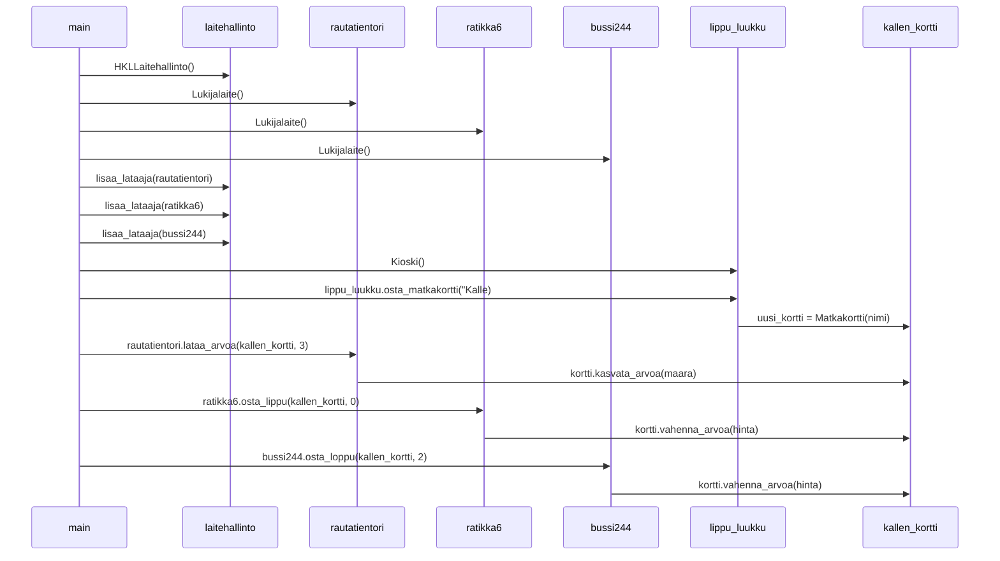

```mermaid
sequenceDiagram
	main ->> laitehallinto: HKLLaitehallinto()
	main ->> rautatientori:  Lukijalaite()
	main ->> ratikka6: Lukijalaite()
	main ->> bussi244: Lukijalaite()
	main ->> laitehallinto: lisaa_lataaja(rautatientori)
	main ->> laitehallinto: lisaa_lataaja(ratikka6)
	main ->> laitehallinto: lisaa_lataaja(bussi244)
	main ->> lippu_luukku: Kioski()
	main ->> lippu_luukku: lippu_luukku.osta_matkakortti("Kalle)
	lippu_luukku ->> kallen_kortti: uusi_kortti = Matkakortti(nimi)
	main ->> rautatientori: rautatientori.lataa_arvoa(kallen_kortti, 3)
	rautatientori ->> kallen_kortti: kortti.kasvata_arvoa(maara)
	main ->> ratikka6: ratikka6.osta_lippu(kallen_kortti, 0)
	ratikka6 ->> kallen_kortti: kortti.vahenna_arvoa(hinta)
	main ->> bussi244: bussi244.osta_loppu(kallen_kortti, 2)
	bussi244 ->> kallen_kortti: kortti.vahenna_arvoa(hinta)

```
