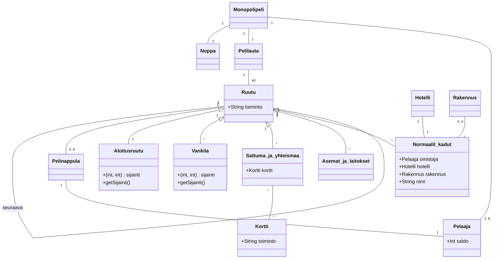

```mermaid
 classDiagram
    Monopolipeli "1" -- "2" Noppa
    Monopolipeli "1" -- "1" Pelilauta
    Pelilauta "1" -- "40" Ruutu
    Ruutu "1" -- "1" Ruutu : seuraava
    Ruutu "1" -- "0..8" Pelinappula
    Ruutu "1" <|-- "1" Aloitusruutu
    Ruutu "1" <|-- "*" Vankila
    Ruutu "1" <|-- "*" Sattuma_ja_yhteismaa
    Ruutu "1" <|-- "*" Asemat_ja_laitokset
    Ruutu "1" <|-- "*" Normaalit_kadut
    Sattuma_ja_yhteismaa "*" -- "*" Kortti
    Hotelli "1" -- "1" Normaalit_kadut
    Rakennus "0..4" -- "1" Normaalit_kadut
    Pelinappula "1" -- "1" Pelaaja
    Pelaaja "2..8" -- "1" Monopolipeli
    class Kortti{
    	+String toiminto
    }
    class Aloitusruutu{
    	+(int, int) sijainti
    	+getSijainti()
    }
    class Vankila{
    	+(int, int) sijainti
    	+getSijainti()
    }
    class Ruutu{
    	+String toiminto
    }
    class Sattuma_ja_yhteismaa{
    	+Kortti kortti
    }
    class Normaalit_kadut{
    	+Pelaaja omistaja
    	+Hotelli hotelli
    	+Rakennus rakennus
    	+String nimi
    }
    class Pelaaja{
    	+Int saldo
    }


```

